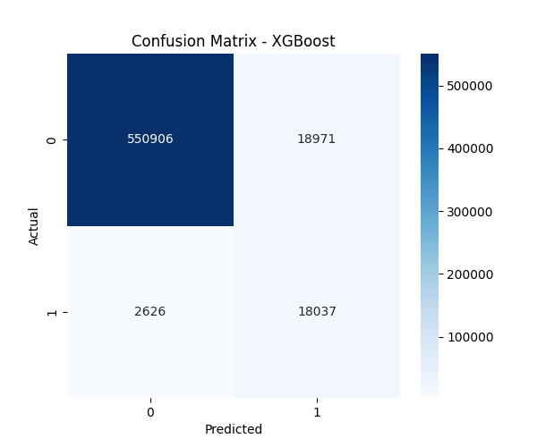
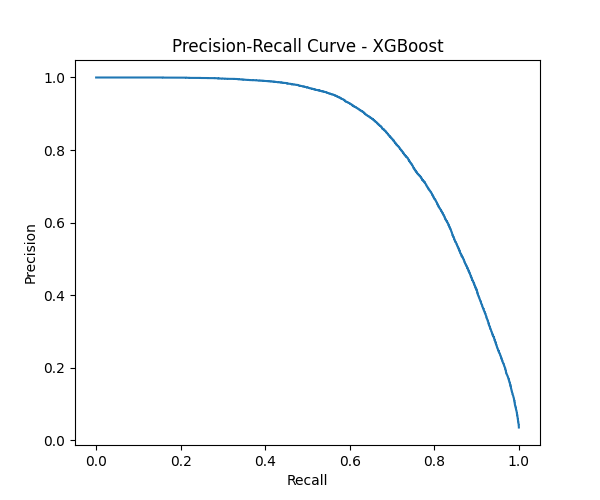

# Fraud Detection Project

This project aims to detect fraudulent transactions using machine learning models. It includes data preprocessing, model training, evaluation, and visualization of results.

## Project Structure
- `data/`: Contains the dataset files (not included in the repository).
- `src/`: Includes scripts for data loading, preprocessing, model training, and evaluation.
- `outputs/`: Stores generated figures and trained models.

## Visualizations
Below are some of the plots generated during the evaluation phase:

### Confusion Matrix


### Precision-Recall Curve


### ROC Curve


## How to Run
1. Set up the Python environment:
   ```bash
   & D:\2025\Fraud_Detection_Project\fraud-env\Scripts\Activate.ps1
   ```
2. Install the required dependencies.
3. Run the scripts in the `src/` folder for data preprocessing, model training, and evaluation.

## Note
The `data/` folder is excluded from the repository for privacy reasons. Please add the dataset files to the `data/` folder before running the project.